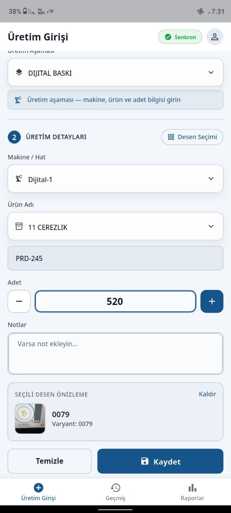
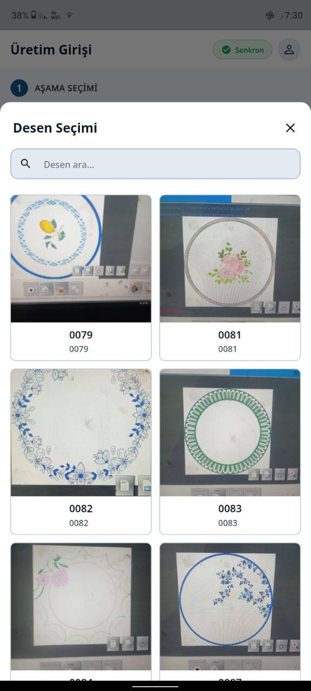
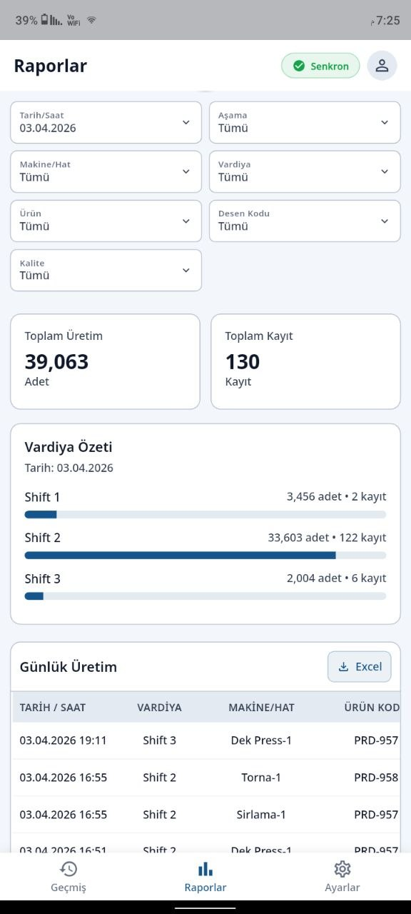
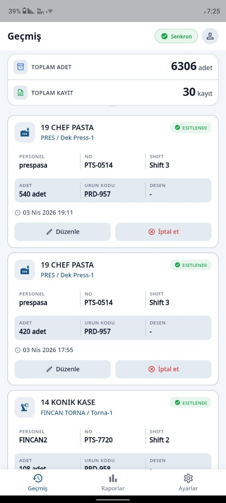
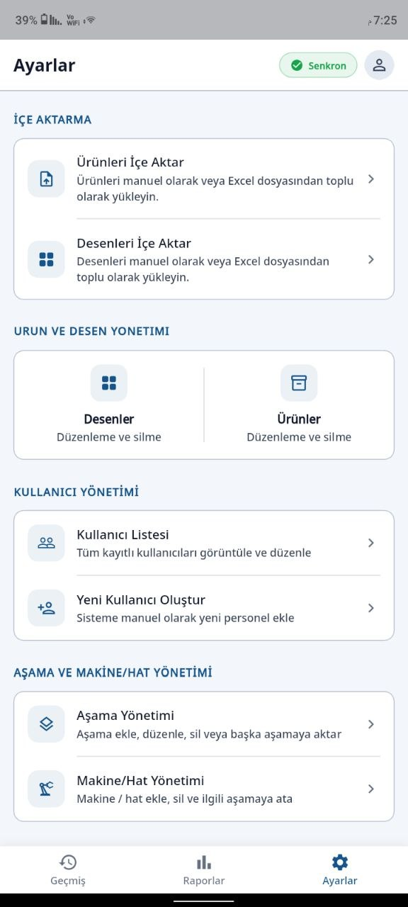

# production tracking system - Frontend

Flutter-based production tracking application for porcelain factory operations.

> ⚠️ This repository contains **frontend only**.
> Backend services, APIs, and internal logic are **not included**.


## 🚀 Highlights

* Role-based workflows (`worker`, `supervisor`, `admin`)
* Production modules: production, quality, packaging, shipment
* Offline-first data entry with local persistence (SQLite via Drift)
* Background synchronization with retry & failover handling
* Product and catalog management with file/image support
* Turkish-first UI (`tr_TR`) with shift-aware behavior


## 📸 Screenshots

| Production Entry                          | Pattern Selection                     |
| ----------------------------------------- | ------------------------------------- |
|  |  |

| Reports                             | History                             |
| ----------------------------------- | ----------------------------------- |
|  |  |

| Admin Panel                     |
| ------------------------------- |
|  |


## 🎥 Demo Video

Watch the app in action:


## 🛠️ Tech Stack

* Flutter / Dart (`>=3.2.0 <4.0.0`)
* State Management: Riverpod
* Networking: Dio
* Local Database: Drift (SQLite)
* Secure Storage: flutter_secure_storage
* Background Tasks: Workmanager


## 📱 Supported Platforms

* Android


## ⚙️ Getting Started

### 1. Install dependencies

```bash
flutter pub get
```

### 2. Run the app

```bash
flutter run
```


## 🔧 Configuration

The API base URL is configured using `--dart-define`:

```bash
flutter run --dart-define=API_BASE_URL=http://localhost:8000/api/v1
```

### Notes

* Android emulator uses:

  ```
  http://10.0.2.2:8000/api/v1
  ```
* Do NOT commit:

  * API keys
  * tokens
  * private endpoints
  * environment secrets


## 🔄 Offline & Sync Behavior

* Data is stored locally when offline
* Sync queue handles retries and failures
* Background sync runs on mobile devices (Android/iOS)
* Desktop platforms do not run background sync


## 🔐 Security Notes

* Tokens are stored using secure storage
* Avoid exposing sensitive production data
* Keep all secrets outside the warehouse (environment-based)


## 🌍 Localization

* Primary language: Turkish (`tr_TR`)
* Date formats and UI follow Turkish localization


