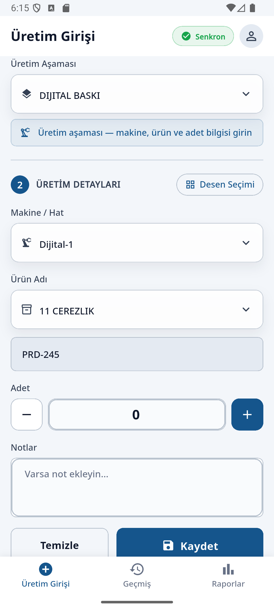
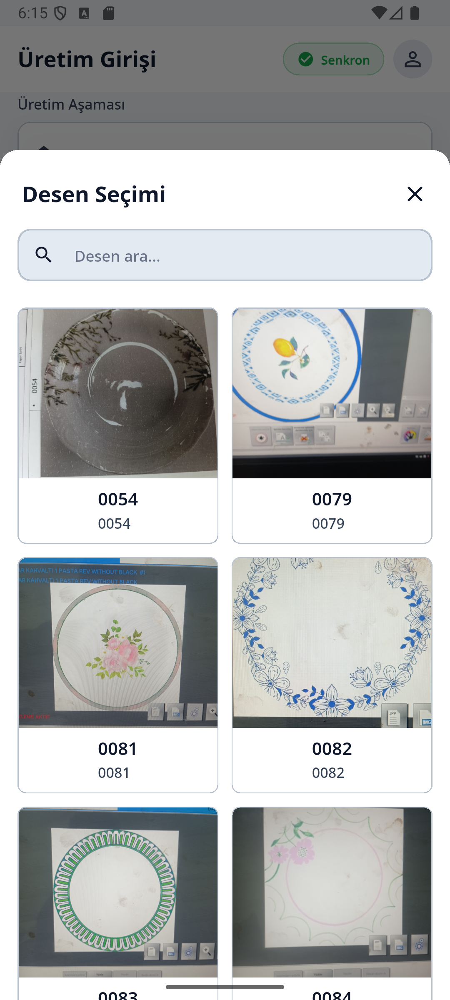
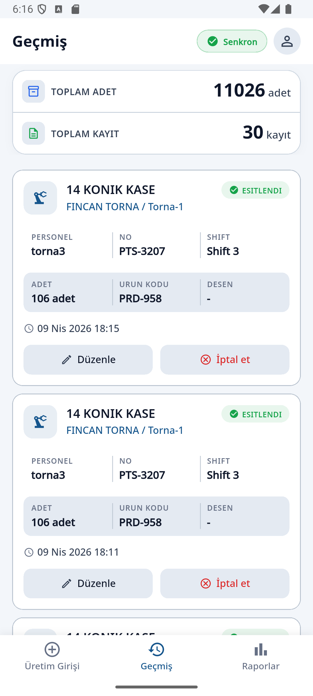
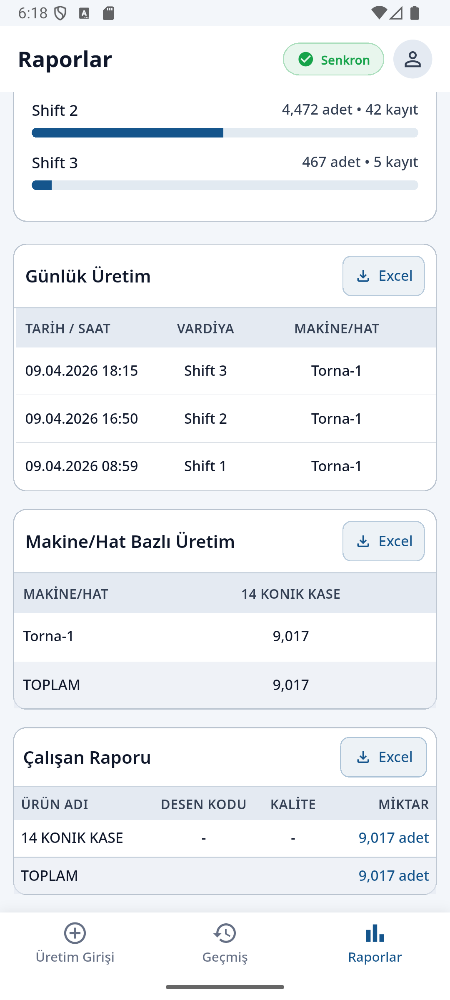
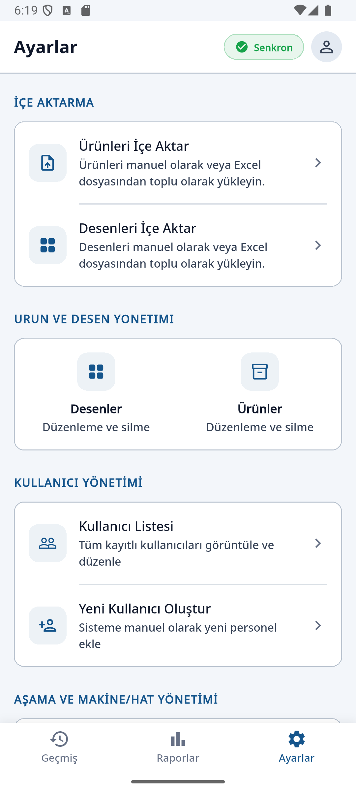
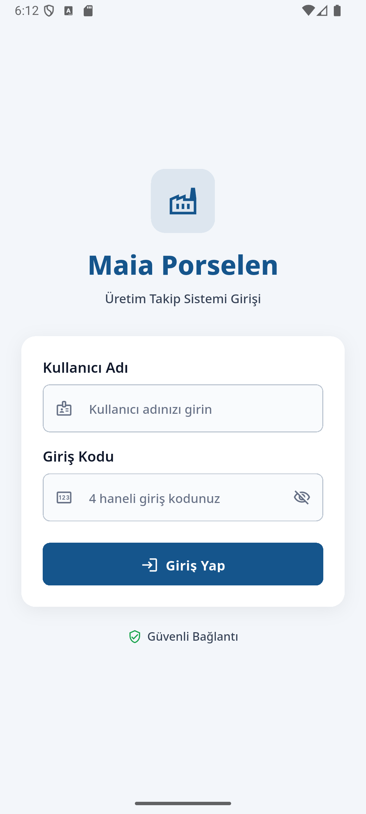
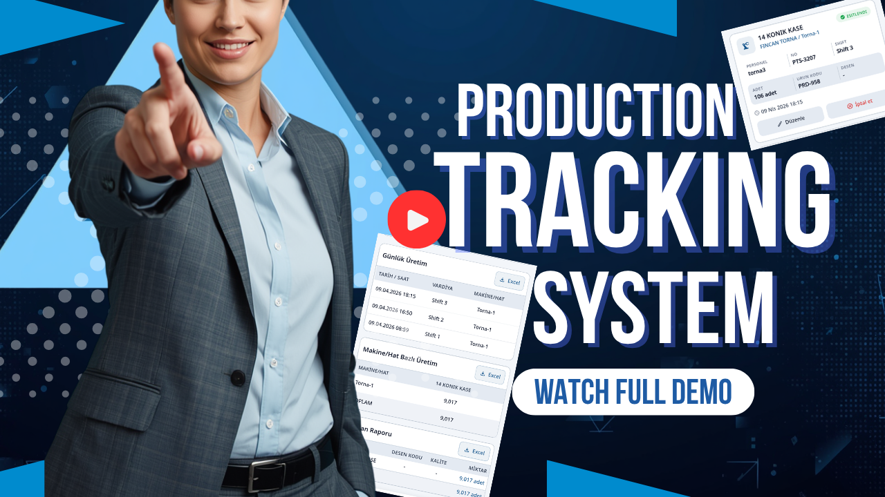

# Production Tracking System

Modern Flutter-based production tracking application designed for factory operations and industrial workflow management.

> ⚠️ This repository is a **public showcase version** and contains **frontend only**.
> Backend services, APIs, infrastructure, authentication logic, and internal business workflows are intentionally excluded.

---

# ✨ Features

* Role-based workflow system

  * Worker
  * Supervisor
  * Admin

* Production management modules

  * Production Tracking
  * Quality Control
  * Packaging
  * Shipment Operations

* Offline-first architecture

* Local persistence with SQLite (Drift)

* Background synchronization & retry handling

* Product / catalog management

* Pattern image support

* Turkish-first localization (`tr_TR`)

* Shift-aware operational behavior

* Optimized mobile workflow experience

---

# 📱 Application Preview

## Production & Operations

<table>
<tr>
<td align="center">

 
<b>Production Entry</b>
</td>

<td align="center">

 
<b>Pattern Selection</b>
</td>

<td align="center">

 
<b>Production History</b>
</td>
</tr>
</table>

---

## Reports & Analytics

<table>
<tr>
<td align="center">

 
<b>Reports</b>
</td>

<td align="center">

 
<b>Admin Panel</b>
</td>

<td align="center">

 
<b>Authentication</b>
</td>
</tr>
</table>

---

# 🎥 Demo Video

  

---

# 🛠️ Tech Stack

## Mobile Application

* Flutter
* Dart

## State Management

* Riverpod

## Networking

* Dio

## Local Storage

* Drift (SQLite)

## Background Processing

* Workmanager

## Security

* flutter_secure_storage

---

# 🏗️ Architecture Highlights

* Clean and scalable Flutter architecture
* Offline-first mobile workflow
* Local caching & synchronization queue
* Background sync with retry/failure handling
* Modular production operation system
* Role-based UI rendering
* Secure local token storage

---

# 📦 Supported Platform

* Android
* IOS

---

# 🔄 Offline & Sync System

* Data is stored locally during offline usage
* Sync queue automatically retries failed requests
* Background synchronization supported on mobile devices
* Optimized for unstable factory network environments

---

# 🔐 Security Notes

* Secure token storage
* Environment-based configuration
* Sensitive infrastructure excluded from public repository
* Internal APIs and business logic are private

---

# 🌍 Localization

Primary language:

* Turkish (`tr_TR`)

Date formatting and UI behavior follow Turkish localization standards.

---

# 📌 Repository Purpose

This repository is intended for:

* Portfolio showcase
* UI/UX demonstration
* Flutter architecture presentation
* Mobile workflow demonstration

It is not intended to expose internal production infrastructure or proprietary business logic.
